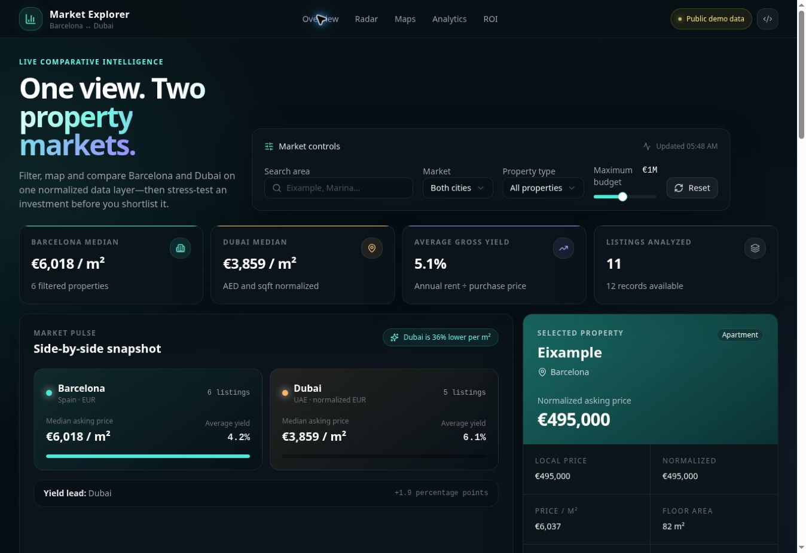
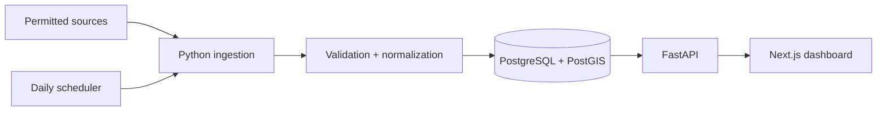

# Barcelona & Dubai Market Explorer

[](https://github.com/anischelly26/barcelona-dubai-market-explorer/actions/workflows/ci.yml)

A full-stack property intelligence platform that normalizes Barcelona and Dubai listings into one geospatial data model, exposes comparative analytics through FastAPI, and presents the results in an interactive Next.js dashboard.

**[Live dashboard](https://barcelona-dubai-market-explorer.rhythmx.chatgpt.site)** · **[Watch the 10-second demo](docs/demo.mp4)** · **[API contract](docs/architecture.md#api-surface)**



> Portfolio and engineering demonstration. The included records are synthetic or curated examples and are not investment advice.

## Why this project matters

Property portals represent price, currency, floor area and location differently. Comparing markets requires more than a chart: the system must collect permitted data, validate it, normalize AED/EUR and sqft/sqm, preserve historical observations, support geographic queries, and make the resulting assumptions visible.

This repository implements that pipeline end to end.

## Delivered capabilities

| Capability | Implementation |
| --- | --- |
| Real-estate ingestion | Rate-limited BeautifulSoup/HTTPX adapter framework for explicitly permitted sources |
| PostgreSQL/PostGIS | Spatial neighborhoods, property coordinates, historical snapshots, FX rates and GiST indexes |
| FastAPI backend | Filtering, summaries, monthly trends, PostGIS radius search and ROI calculation |
| React/Next.js interface | Responsive dashboard with typed API integration and explicit fallback state |
| Property radar | Neighborhood search, city and budget filters, explainable opportunity scoring and strategy-based shortlisting |
| Interactive maps | Two Leaflet/OpenStreetMap views with selectable property markers |
| Price normalization | AED to EUR, sqft to sqm, EUR/m², rental yield and content fingerprints |
| Automation and tests | Daily scheduler, Python and TypeScript unit tests, GitHub Actions and Docker builds |
| Deployment | Docker Compose for the complete stack plus a deployed frontend demo |

## Architecture



See [architecture.md](docs/architecture.md) for the data model, endpoints and reliability decisions.

## Technology

- **Frontend:** Next.js, React, TypeScript, Tailwind CSS, Leaflet, Recharts, Vitest
- **Backend:** FastAPI, Pydantic, SQLAlchemy async, HTTPX, BeautifulSoup, APScheduler
- **Data:** PostgreSQL 16, PostGIS, normalized price snapshots and spatial indexes
- **Delivery:** Docker Compose, GitHub Actions, Cloudflare-compatible frontend runtime

## Run the complete stack

```bash
cp .env.example .env
docker compose up --build
```

Then open:

- Dashboard: `http://localhost:3000`
- API documentation: `http://localhost:8000/docs`
- Health check: `http://localhost:8000/health`

The database is initialized with a small, deterministic dataset. Configure `MARKET_INGESTION_SOURCE_URL` only for a source that explicitly permits automated collection.

## Run without Docker

Frontend:

```bash
npm install
npm run dev
```

Backend in demo mode:

```bash
python -m venv .venv
source .venv/bin/activate
pip install -r backend/requirements.txt
uvicorn backend.app.main:app --reload
```

Without `MARKET_DATABASE_URL`, FastAPI serves the same typed demo contract from memory. This makes the project easy to evaluate while keeping database mode production-oriented.

## Verification

```bash
npm run lint
npm run typecheck
npm test
npm run build
pytest -q backend/tests
```

CI repeats these checks and builds both production containers on every pull request.

## Example API calls

```bash
curl "http://localhost:8000/v1/properties?city=Dubai&max_price_eur=500000"

curl "http://localhost:8000/v1/properties/nearby?latitude=41.39&longitude=2.17&radius_m=5000"

curl -X POST "http://localhost:8000/v1/analytics/roi" \
  -H "Content-Type: application/json" \
  -d '{"purchase_price_eur":350000,"monthly_rent_eur":2100,"annual_costs_eur":3600,"vacancy_rate_pct":5,"acquisition_costs_pct":10}'
```

## Data ethics

This project does not bypass authentication, CAPTCHAs, robots controls or rate limits. Before adding any live source, verify its terms, license, retention requirements and personal-data implications. Prefer public datasets and official or licensed APIs.

## Author

**Anis Chelli** — final-year Software Engineering student focused on full-stack development, data engineering and applied AI.

[GitHub profile](https://github.com/anischelly26)
