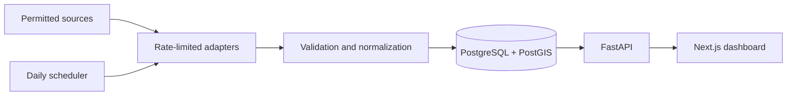

# Architecture notes

## System boundaries

The repository separates source-specific extraction from the normalized domain model. A connector produces `RawListing` values; the normalization service converts currency and area units, validates the record, and calculates comparable metrics before persistence.

## Data model

- `neighborhoods`: city-level spatial boundaries and centers.
- `properties`: stable listing identity, source metadata, coordinates and current descriptive fields.
- `price_snapshots`: append-only observations for time-series analysis.
- `fx_rates`: dated conversion rates with provenance.
- `ingestion_runs`: operational audit trail and quality counts.

`properties.geom` and `neighborhoods.boundary` are spatially indexed. The nearby endpoint uses `ST_DWithin`, while market trends aggregate price snapshots by month.

## API surface

| Method | Endpoint | Purpose |
| --- | --- | --- |
| GET | `/health` | Service and data-mode status |
| GET | `/v1/properties` | Filter normalized properties |
| GET | `/v1/properties/nearby` | Radius search powered by PostGIS |
| GET | `/v1/analytics/summary` | City-level market metrics |
| GET | `/v1/analytics/trends` | Monthly EUR/m² comparison |
| POST | `/v1/analytics/roi` | Gross and net ROI scenario |

FastAPI exposes the complete interactive contract at `/docs` and the OpenAPI document at `/openapi.json`.

## Reliability decisions

- Source requests use explicit timeouts, a declared user agent, bounded retries and a delay.
- Duplicate source records are prevented by `(source_name, external_id)`.
- Historical snapshots are append-only and independently indexed.
- The frontend falls back to a clearly labelled demo dataset if the API is unavailable.
- CI runs linting, TypeScript checks, frontend unit tests, backend tests and both container builds.

## Responsible data collection

The adapter framework is intentionally incapable of CAPTCHA bypassing, session theft or other anti-blocking evasion. Every real connector must have a documented permission basis, source-specific rate limits, retention rules and personal-data review.

